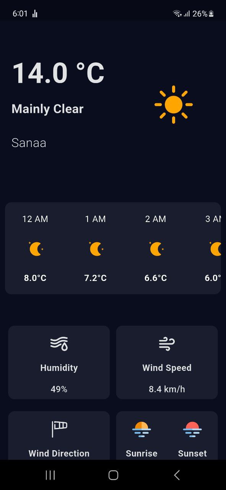

# 🌦️ Weather: Your Ultimate Flutter Weather App

---

## 📸 Screenshot  

---

## 🚀 Features  

### 🌤️ Real-Time Weather  
- Fetches current weather data dynamically from a weather API.  
- Displays temperature, humidity, wind speed, and weather conditions.  

### 📅 Forecast  
- View hourly and daily weather forecasts.  
- Smooth UI for navigating between current conditions and forecast.  

### 💾 Offline Caching  
- Saves the last fetched weather data using **SharedPreferences**.  
- Allows viewing weather info even when offline.  

### ⚡ Built with Efficiency  
- **State Management:** Uses **BLoC** for predictable and scalable state handling.  
- **Dependency Injection:** Powered by **get_it** for clean and modular architecture.  
- **Clean Architecture:** Separates data, domain, and presentation layers for maintainability.  

---

## 🛠️ Tech Stack  

- **Framework:** Flutter  
- **State Management:** BLoC  
- **Dependency Injection:** get_it  
- **Local Storage:** SharedPreferences  
- **Architecture:** Clean Architecture  
- **API:** Weather API (replace with actual API name/link)  

---

## 🌟 Why Weather?  
Weather provides accurate, real-time updates in a sleek, responsive interface.  
It’s perfect for anyone who wants quick weather info, offline access, and a well-structured Flutter app.

---

## 💡 How It Works  

1. **Fetch Weather:** App fetches data from the weather API when online.  
2. **Cache Locally:** Last successful data fetch is stored using SharedPreferences.  
3. **Display UI:** BLoC handles state updates, and UI updates dynamically with current data.  
4. **View Forecast:** Users can navigate to hourly and daily forecasts.  

---

## 🔧 Future Enhancements  

- Add notifications for severe weather alerts.  
- Dark mode / theme switching.  
- Integration with multiple weather APIs for redundancy.  
- Enhanced offline support with data persistence.  

---

## 🧑‍💻 Author  

**Ahmed Anam**  
Flutter Developer | Laravel Backend Developer  
[GitHub Profile](https://github.com/Ahmedanam74)  

---

## 📜 License  

This project is licensed under the **MIT License**.
